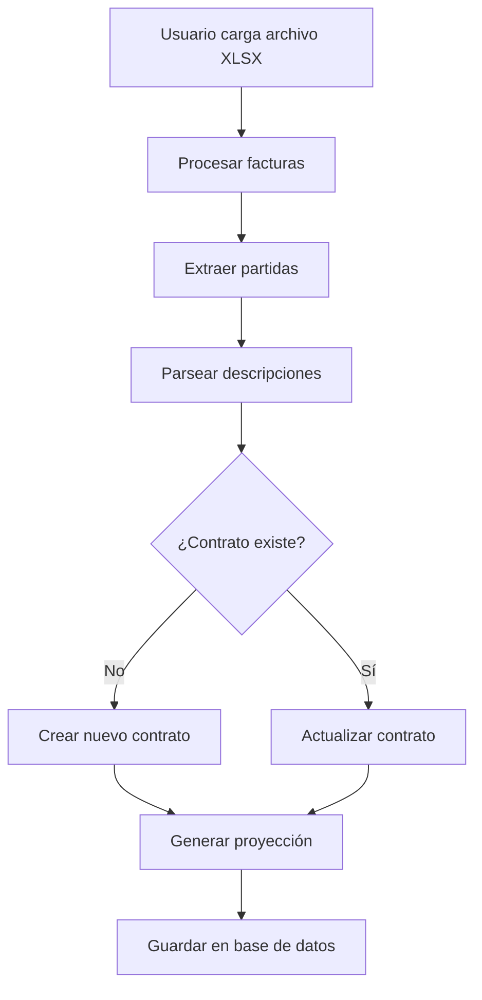

# Sistema de Proyección de Facturación Mensual

## Descripción General

El sistema de proyección de facturación mensual es un módulo avanzado que analiza automáticamente las descripciones de las facturas de arrendamiento para extraer información de contratos, calcular rentas pendientes y generar proyecciones de ingresos futuros.

## Componentes del Sistema

### 1. Parser de Partidas (`partidaParser.ts`)

Extrae información estructurada de las descripciones de partidas de factura.

**Formato esperado de descripción:**
```
ARRENDAMIENTO - [MARCA] - [MODELO] - [AÑO] - NS:[NÚMERO_SERIE] - EXP:[NÚMERO_CONTRATO]: RENTA [X] DE [Y] DEL [FECHA_INICIO] AL [FECHA_FIN]
```

**Ejemplo real:**
```
ARRENDAMIENTO - CHEVROLET - AVEO - 2022 - NS:045603 - EXP:166: RENTA 36 DE 36 DEL 01 de enero de 2025 AL 31 de enero de 2025
```

**Información extraída:**
- **Tipo de Servicio**: ARRENDAMIENTO
- **Descripción del Activo**: CHEVROLET - AVEO - 2022
- **Número de Serie (NS)**: 045603
- **Número de Contrato (EXP)**: 166
- **Renta Actual**: 36
- **Total de Rentas**: 36
- **Período Inicio**: 01/01/2025
- **Período Fin**: 31/01/2025

### 2. Motor de Proyección

Genera automáticamente la proyección mensual de ingresos basándose en:
- Renta actual del contrato
- Total de rentas del contrato
- Monto mensual
- Fecha de próxima renta

**Cálculo:**
```
Rentas Pendientes = Total Rentas - Renta Actual
Proyección = [Mes 1, Mes 2, ..., Mes N] donde N = Rentas Pendientes
```

### 3. Integración Automática (`contratoIntegration.ts`)

Procesa automáticamente las facturas cuando se cargan archivos XLSX:

1. **Detección de Contratos**: Identifica contratos nuevos o existentes
2. **Creación/Actualización**: Crea contratos nuevos o actualiza los existentes
3. **Generación de Proyección**: Calcula automáticamente la proyección mensual
4. **Finalización**: Marca contratos como inactivos cuando llegan a la última renta

## Flujo de Trabajo

### Carga de Archivos



### Actualización de Contratos

Cuando se procesa una factura nueva:

1. **Contrato Nuevo (Renta 1)**:
   - Se crea el registro del contrato
   - Se genera proyección completa (rentas 2 hasta N)
   - Estado: ACTIVO

2. **Contrato Existente (Renta 2 a N-1)**:
   - Se actualiza `rentaActual`
   - Se actualiza `fechaProximaRenta`
   - Se regenera proyección (rentas pendientes)
   - Estado: ACTIVO

3. **Última Renta (Renta N de N)**:
   - Se actualiza `rentaActual`
   - Se marca `activo = false`
   - Se elimina proyección (ya no hay rentas pendientes)
   - Estado: FINALIZADO

## Estructura de Base de Datos

### Tabla: `contratos`

| Campo | Tipo | Descripción |
|-------|------|-------------|
| id | INT | ID único del contrato |
| numeroContrato | VARCHAR | Número de contrato (EXP) |
| clienteId | INT | Referencia al cliente |
| nombreCliente | VARCHAR | Nombre del cliente |
| empresa | ENUM | tim_transp o tim_value |
| tipoServicio | VARCHAR | ARRENDAMIENTO |
| descripcionActivo | TEXT | Descripción del activo arrendado |
| numeroSerie | VARCHAR | Número de serie del activo (NS) |
| totalRentas | INT | Total de rentas del contrato |
| rentaActual | INT | Renta actual (última facturada) |
| montoMensual | DECIMAL | Monto mensual de la renta |
| fechaInicio | DATE | Fecha de inicio del contrato |
| fechaProximaRenta | DATE | Fecha proyectada de próxima renta |
| fechaTermino | DATE | Fecha estimada de término |
| activo | BOOLEAN | Si el contrato está activo |

### Tabla: `proyeccion_mensual`

| Campo | Tipo | Descripción |
|-------|------|-------------|
| id | INT | ID único de la proyección |
| contratoId | INT | Referencia al contrato |
| mes | DATE | Mes de la proyección (primer día) |
| montoProyectado | DECIMAL | Monto proyectado para ese mes |
| montoReal | DECIMAL | Monto real facturado (NULL si no facturado) |
| rentaNumero | INT | Número de renta correspondiente |
| esUltimaRenta | BOOLEAN | Si es la última renta del contrato |
| facturaId | INT | Referencia a la factura (cuando se factura) |

### Tabla: `partidas_factura`

| Campo | Tipo | Descripción |
|-------|------|-------------|
| id | INT | ID único de la partida |
| facturaId | INT | Referencia a la factura |
| contratoId | INT | Referencia al contrato |
| descripcion | TEXT | Descripción completa de la partida |
| monto | DECIMAL | Monto de la partida |
| tipoServicio | VARCHAR | Tipo de servicio |
| numeroContrato | VARCHAR | Número de contrato extraído |
| numeroSerie | VARCHAR | Número de serie extraído |
| descripcionActivo | TEXT | Descripción del activo |
| rentaActual | INT | Renta actual extraída |
| totalRentas | INT | Total de rentas extraído |
| periodoInicio | DATE | Período inicio extraído |
| periodoFin | DATE | Período fin extraído |

## API Endpoints (tRPC)

### Consulta de Contratos

```typescript
// Listar todos los contratos
trpc.proyeccion.contratos.useQuery()

// Obtener contratos activos
trpc.proyeccion.contratosActivos.useQuery()

// Obtener contratos próximos a vencer (3 o menos rentas pendientes)
trpc.proyeccion.contratosProximosAVencer.useQuery({ limite: 10 })

// Obtener contratos por cliente
trpc.proyeccion.contratosByCliente.useQuery({ clienteId: 123 })

// Obtener contratos por empresa
trpc.proyeccion.contratosByEmpresa.useQuery({ empresa: 'tim_transp' })
```

### Consulta de Proyecciones

```typescript
// Proyección consolidada por mes
trpc.proyeccion.proyeccionConsolidada.useQuery({
  fechaInicio: '2025-01-01',
  fechaFin: '2025-12-31'
})

// Proyección por empresa
trpc.proyeccion.proyeccionPorEmpresa.useQuery({
  fechaInicio: '2025-01-01',
  fechaFin: '2025-12-31'
})

// Proyección por grupo de clientes
trpc.proyeccion.proyeccionPorGrupo.useQuery({
  fechaInicio: '2025-01-01',
  fechaFin: '2025-12-31'
})

// Proyecciones de un contrato específico
trpc.proyeccion.proyeccionesByContrato.useQuery({ contratoId: 456 })

// Detalles completos de un contrato
trpc.proyeccion.contratoDetalle.useQuery({ numeroContrato: '166' })
```

## Dashboard de Proyección

El dashboard proporciona visualizaciones interactivas:

### Métricas Clave (KPIs)

1. **Total Proyectado**: Suma de ingresos proyectados en el período seleccionado
2. **Contratos Activos**: Cantidad de contratos generando ingresos
3. **Próximos a Vencer**: Contratos con 3 o menos rentas pendientes
4. **Promedio Mensual**: Ingreso proyectado promedio por mes

### Visualizaciones

1. **Proyección Mensual Consolidada** (Gráfico de líneas)
   - Ingresos proyectados vs reales por mes
   - Permite comparar la proyección con la facturación real

2. **Proyección por Empresa** (Gráfico de barras)
   - Comparativo Tim Transp vs Tim Value
   - Agrupado por mes

3. **Proyección por Grupo** (Tabla)
   - Ingresos proyectados por grupo de clientes
   - Cantidad de contratos por grupo

4. **Contratos Próximos a Vencer** (Tabla)
   - Listado de contratos con pocas rentas pendientes
   - Información para renovación

### Filtros Disponibles

- **Período de Proyección**: 3, 6, 12 o 24 meses
- **Empresa**: Todas, Tim Transp, Tim Value
- **Grupo**: Todos los grupos o grupo específico
- **Estado**: Activos, Finalizados, Todos

## Casos de Uso

### 1. Proyección de Ingresos Anuales

**Objetivo**: Conocer los ingresos proyectados para el próximo año

**Pasos**:
1. Ir a **Proyección** en el menú
2. Seleccionar "Próximos 12 meses"
3. Ver gráfico de proyección consolidada
4. Exportar datos si es necesario

**Resultado**: Gráfico mensual con ingresos proyectados y total anual

### 2. Identificar Contratos por Renovar

**Objetivo**: Detectar contratos que están por terminar para gestionar renovación

**Pasos**:
1. Ir a **Proyección** > Tab "Contratos"
2. Ver tabla "Contratos Próximos a Vencer"
3. Identificar contratos con 1-3 rentas pendientes
4. Contactar clientes para renovación

**Resultado**: Lista de contratos que requieren atención

### 3. Análisis por Grupo Corporativo

**Objetivo**: Ver proyección de ingresos por grupo de clientes

**Pasos**:
1. Ir a **Proyección** > Tab "Por Grupo"
2. Ver tabla con proyección por grupo
3. Identificar grupos con mayor contribución
4. Analizar concentración de ingresos

**Resultado**: Tabla con ingresos proyectados por grupo

### 4. Comparativo Tim Transp vs Tim Value

**Objetivo**: Comparar proyección de ingresos entre ambas empresas

**Pasos**:
1. Ir a **Proyección** > Tab "Por Empresa"
2. Ver gráfico de barras comparativo
3. Analizar distribución mensual
4. Identificar tendencias

**Resultado**: Gráfico comparativo por empresa

## Mantenimiento y Consideraciones

### Actualización Automática

El sistema se actualiza automáticamente cada vez que:
- Se carga un archivo de facturación (Tim Transp o Tim Value)
- Se detecta una nueva partida de arrendamiento
- Se procesa una renta de un contrato existente

### Integridad de Datos

- Los contratos se identifican por `numeroContrato` normalizado
- Los números de contrato con ceros a la izquierda se normalizan (0166 → 166)
- Las fechas se extraen en múltiples formatos (DD/MM/YYYY, texto)
- Los montos se normalizan eliminando símbolos de moneda

### Validaciones

El parser valida que:
- La descripción contenga "ARRENDAMIENTO"
- Exista número de contrato (EXP)
- Existan rentas (X DE Y)
- Las fechas sean válidas

### Limitaciones Conocidas

1. **Formato de Descripción**: El parser requiere un formato específico. Descripciones con formato diferente no se procesarán.

2. **Cambios de Monto**: Si el monto mensual cambia durante el contrato, la proyección se regenera con el nuevo monto.

3. **Contratos Sin Cliente**: Si el cliente no existe en la base de datos, se guarda el nombre pero no se vincula a un registro de cliente.

4. **Rentas Saltadas**: Si se factura la renta 10 y luego la 12 (saltando la 11), el sistema asume continuidad.

## Troubleshooting

### Problema: No se detectan contratos

**Causas posibles**:
- Formato de descripción incorrecto
- Falta información requerida (EXP, RENTA X DE Y)
- Descripción no contiene "ARRENDAMIENTO"

**Solución**: Verificar formato de descripción en archivo XLSX

### Problema: Proyección incorrecta

**Causas posibles**:
- Renta actual mal extraída
- Total de rentas incorrecto
- Monto mensual erróneo

**Solución**: Revisar partida en tabla `partidas_factura` y verificar extracción

### Problema: Contratos duplicados

**Causas posibles**:
- Números de contrato con formatos diferentes (166 vs 0166 vs EXP166)

**Solución**: La normalización automática debería prevenir esto. Si ocurre, revisar función `normalizarNumeroContrato`

## Mejoras Futuras

1. **Alertas Automáticas**: Notificaciones cuando un contrato está por vencer
2. **Comparativo Real vs Proyectado**: Análisis de desviaciones
3. **Proyección con Inflación**: Ajuste de montos por inflación proyectada
4. **Exportación Avanzada**: Exportar proyecciones a Excel con gráficos
5. **Análisis Predictivo**: ML para predecir renovaciones y cancelaciones
6. **Integración con CRM**: Sincronización con sistema de gestión de clientes
7. **Dashboard Ejecutivo**: Resumen para dirección con métricas clave

## Soporte

Para dudas o problemas con el sistema de proyección:
1. Revisar esta documentación
2. Verificar logs de auditoría en la base de datos
3. Consultar tests unitarios para ejemplos de uso
4. Contactar al equipo de desarrollo

---

**Última actualización**: Febrero 2026
**Versión del sistema**: 1.0.0
